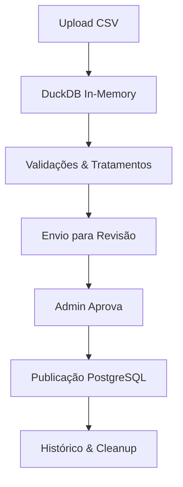

# 🚀 Leonardo - Sistema de Validação de Dados e Gerenciamento de Réplicas

> Plataforma completa para validação, tratamento e publicação de dados de peças automotivas, com gerenciamento integrado de réplicas PostgreSQL.

**Desenvolvido para:** Portfolio Profissional e Uso Empresarial Ativo  
**Stack:** React + TypeScript + FastAPI + DuckDB + PostgreSQL + Docker

---

## 📋 Índice

- [Visão Geral](#-visão-geral)
- [Funcionalidades Principais](#-funcionalidades-principais)
- [Módulos do Sistema](#-módulos-do-sistema)
- [Stack Tecnológica](#-stack-tecnológica)
- [Como Executar](#-como-executar)
- [Arquitetura](#-arquitetura)
- [API Reference](#-api-reference)

---

## 🎯 Visão Geral

Este sistema foi desenvolvido para **automatizar e profissionalizar** o processo de validação e publicação de dados de peças automotivas. Ele substitui processos manuais por um workflow completo e rastreável, desde o upload do arquivo CSV até a publicação no banco de produção.

### Problema Resolvido

Empresas do setor automotivo recebem planilhas de fornecedores com dados inconsistentes: marcas despadronizadas, duplicatas, NCMs inválidos, códigos de barras mal formatados, etc. O sistema **automatiza** toda a limpeza, normalização e validação desses dados.

### Diferenciais

✅ **Workflow Completo** - Da importação à publicação  
✅ **Validações Automáticas** - NCM, EAN, pesos, dimensões, marcas  
✅ **Interface Intuitiva** - Dark mode, responsiva, feedback em tempo real  
✅ **Rastreabilidade** - Histórico completo de ações e relatórios de qualidade  
✅ **Multi-tenant** - Gerenciamento de usuários DEV e ADM  
✅ **Réplicas Isoladas** - Cada desenvolvedor tem seu próprio banco PostgreSQL

---

## 🎨 Funcionalidades Principais

### 1️⃣ **Módulo de Validação de Dados**

#### 🔹 Para Desenvolvedores (DEV)

**Upload e Gestão de Projetos**

- ✅ Upload de arquivos CSV (drag & drop)
- ✅ Visualização de dados com paginação
- ✅ Dashboard com lista de projetos e status
- ✅ Exclusão de projetos

**Workflow de Tratamento em 8 Etapas**

1. **📊 Visualização** - Preview dos dados brutos com paginação
2. **🔧 Tratamento de Estrutura** - Mapeamento e renomeação de colunas
3. **🧹 Tratamento de Dados** - Correção automática de:
   - Conversão para MAIÚSCULAS
   - Preenchimento de valores nulos (strings e numéricos)
   - Validação e formatação de NCM (8 dígitos)
   - Validação de códigos de barras (EAN-8, EAN-13, UPC-12)
   - Validação de pesos (bruto > líquido)
   - Validação de dimensões (range válido)
   - Sanitização de códigos (alfanuméricos)
4. **✨ Mapeamento de Marcas** - Normalização automática baseada em dicionário oficial
5. **🔗 Remoção de Duplicatas** - Identificação e remoção baseada em search_ref + marca
6. **🔍 Análise de Similaridades** - Detecção de registros similares com sugestões de correção
7. **📈 Estatísticas** - Dashboard com métricas de qualidade dos dados
8. **📤 Revisão e Envio** - Validação final e envio para aprovação

**Controle de Fluxo**

- ✅ Envio de projeto para revisão administrativa
- ✅ Cancelamento de envio (volta ao modo de edição)
- ✅ Modo somente leitura após envio

#### 🔹 Para Administradores (ADM)

**Aprovação de Validações**

- ✅ Dashboard com fila de projetos pendentes
- ✅ Visualização completa dos dados tratados
- ✅ Relatório de Qualidade automático:
  - Análise de completude das colunas
  - Métricas de qualidade de marcas
  - Estatísticas de duplicatas removidas
  - Análise de similaridades
- ✅ Rejeição de projetos (com motivo)
- ✅ Reprocessamento de relatórios
- ✅ Download de CSV processado

**Publicação no Banco de Produção**

- ✅ Preview de impacto (peças novas vs existentes)
- ✅ Configuração granular de estratégias de atualização:
  - **Ignorar** - não atualiza o campo
  - **Substituir** - sobrescreve sempre
  - **Concatenar** - junta valores (com quebra de linha)
  - **Preencher se vazio** - atualiza apenas campos NULL
- ✅ Validação de marcas (cria novas ou valida existentes)
- ✅ Publicação com rollback automático em caso de erro
- ✅ Atualização de status do projeto

**Histórico de Validações**

- ✅ Listagem de todos os projetos publicados
- ✅ Detalhes de cada publicação (estatísticas finais)
- ✅ Rastreabilidade completa

### 2️⃣ **Módulo de Réplicas PostgreSQL**

#### 🔹 Para Desenvolvedores (DEV)

**Gestão de Réplica Pessoal**

- ✅ Criação de container PostgreSQL isolado
- ✅ Visualização de credenciais de conexão
- ✅ Guia de conexão SSH tunneling
- ✅ Exclusão da própria réplica

#### 🔹 Para Administradores (ADM)

**Gestão de Todas as Réplicas**

- ✅ Visualização de todas as réplicas ativas
- ✅ Detalhes de cada container (porta, database, status)
- ✅ Exclusão individual de réplicas
- ✅ Exclusão em massa com confirmação segura

### 3️⃣ **Gestão de Usuários**

**Para Administradores (ADM)**

- ✅ Criação de usuários (DEV ou ADM)
- ✅ Listagem de todos os usuários
- ✅ Exclusão de usuários
- ✅ Visualização de roles e permissões

- ✅ Exclusão de usuários
- ✅ Visualização de roles e permissões

### 4️⃣ **Experiência do Usuário**

**Design System Moderno**

- 🎨 Dark mode nativo com tema zinc/emerald
- 📱 Interface 100% responsiva
- ⚡ Animações suaves e transições
- 🎯 Feedback visual em tempo real
- 🔔 Sistema de modais customizados (substitui alerts do navegador)
- 🎭 Estados de loading e erro consistentes

**Navegação Intuitiva**

- 🧭 Sidebar colapsável
- 📊 Dashboard centralizado
- 🔍 Breadcrumbs e navegação contextual
- 🎯 Indicadores visuais de progresso

---

## 🏗️ Módulos do Sistema

### 📁 Módulo Data Validation

Sistema completo de ETL (Extract, Transform, Load) para dados de peças automotivas.

**Fluxo Completo:**

```
Upload CSV → Tratamento Multi-etapa → Revisão → Aprovação ADM → Publicação
```

**Tecnologias:**

- **DuckDB** - Banco analítico em memória para processamento rápido
- **Pandas-like API** - Manipulação de dados
- **Validações customizadas** - Regras de negócio específicas

**Validações Implementadas:**

- ✅ NCM (8 dígitos obrigatórios)
- ✅ Códigos de barras (EAN-8/13, UPC-12)
- ✅ Pesos (bruto ≥ líquido, > 0)
- ✅ Dimensões (0 < valor < 1000 cm)
- ✅ Normalização de marcas (dicionário oficial)
- ✅ Detecção de duplicatas
- ✅ Análise de similaridade

### 🐘 Módulo Réplicas

Sistema de provisionamento automático de ambientes PostgreSQL isolados.

**Características:**

- Containers Docker efêmeros
- Portas dinâmicas (5433+)
- Isolamento total entre usuários
- Cleanup automático

**Casos de Uso:**

- Desenvolvimento local
- Testes de integração
- Treinamento de equipe
- Experimentação segura

### 👥 Módulo de Usuários

Sistema de autenticação e autorização multi-tenant.

**Roles:**

- **DEV** - Acesso a validação e réplica pessoal
- **ADM** - Acesso total (aprovações, publicações, gestão)

**Segurança:**

- JWT com expiração configurável
- Bcrypt para hashing de senhas
- Middleware de autenticação
- CORS configurável

---

## 🚀 Stack Tecnológica

### 🎨 Frontend

| Tecnologia       | Versão | Uso                       |
| ---------------- | ------ | ------------------------- |
| **React**        | 18     | Framework UI              |
| **TypeScript**   | 5.5    | Tipagem estática          |
| **React Router** | 6.26   | Roteamento SPA            |
| **Tailwind CSS** | 3.4    | Estilização utility-first |
| **Lucide React** | Latest | Ícones modernos           |
| **Axios**        | 1.7    | Cliente HTTP              |
| **Vite**         | 5.4    | Build tool ultra-rápido   |

### ⚙️ Backend

| Tecnologia      | Versão | Uso                      |
| --------------- | ------ | ------------------------ |
| **FastAPI**     | 0.115  | Framework REST API       |
| **Python**      | 3.11   | Linguagem backend        |
| **SQLAlchemy**  | 2.0    | ORM para metadados       |
| **DuckDB**      | 1.1    | Banco analítico          |
| **PostgreSQL**  | 16     | Banco de produção        |
| **Docker SDK**  | 7.1    | Orquestração de réplicas |
| **Pydantic**    | 2.9    | Validação de dados       |
| **python-jose** | 3.3    | JWT handling             |
| **bcrypt**      | 4.2    | Hashing de senhas        |
| **psycopg2**    | 2.9    | Driver PostgreSQL        |

### 🐳 DevOps

- **Docker** - Containerização
- **Docker Compose** - Orquestração local
- **Multi-stage builds** - Otimização de imagens
- **Volume mounts** - Persistência de dados

---

## 📦 Como Executar

### Pré-requisitos

```bash
- Docker 24+
- Docker Compose 2+
- Portas disponíveis: 8000 (app), 5432+ (réplicas)
```

### Opção 1: Docker Compose (Recomendado)

```bash
# 1. Clone o repositório
git clone https://github.com/seu-usuario/replicas-v2.git
cd replicas-v2

# 2. Configure variáveis de ambiente
cp .env.example .env
# Edite o .env com suas credenciais

# 3. Inicie os serviços
docker compose up -d

# 4. Verifique os logs
docker compose logs -f

# 5. Acesse a aplicação
# Frontend: http://localhost:8000
# API Docs: http://localhost:8000/docs
```

### Opção 2: Build Manual

```bash
# Build da imagem (multi-stage)
docker build -f backend/Dockerfile -t leonardo-replicas:latest .

# Rodar container
docker run -d \
  --name leonardo-replicas \
  -p 8000:8000 \
  -v /var/run/docker.sock:/var/run/docker.sock \
  -e JWT_SECRET_KEY="sua-chave-super-segura-aqui" \
  -e DATABASE_URL="sqlite:///./metadata.db" \
  -e PROD_DB_HOST="seu-postgres-host" \
  -e PROD_DB_PORT="5432" \
  -e PROD_DB_NAME="production_db" \
  -e PROD_DB_USER="postgres" \
  -e PROD_DB_PASSWORD="sua-senha" \
  leonardo-replicas:latest
```

### Opção 3: Desenvolvimento Local

**Backend:**

```bash
cd backend
python -m venv venv
source venv/bin/activate  # Windows: venv\Scripts\activate
pip install -r ../requirements.txt
uvicorn backend.main:app --reload --host 0.0.0.0 --port 8000
```

**Frontend:**

```bash
cd frontend
npm install
npm run dev
# Acesse http://localhost:5173
```

### 🔐 Criar Primeiro Usuário Admin

```bash
# Método 1: Script Python
python -m backend.scripts.create_admin

# Método 2: API direta
curl -X POST "http://localhost:8000/users/" \
  -H "Content-Type: application/json" \
  -d '{
    "usuario": "admin",
    "password": "admin123",
    "role": "adm"
  }'
```

**Login:** http://localhost:8000/login

---

## 🏛️ Arquitetura

### Estrutura de Diretórios

---

## 🏛️ Arquitetura

### Estrutura de Diretórios

```
replicas-v2/
├── backend/
│   ├── core/                      # Núcleo do sistema
│   │   ├── database.py            # Configuração SQLAlchemy
│   │   ├── models.py              # Modelos de dados (User, Project)
│   │   ├── schemas.py             # Schemas Pydantic
│   │   ├── security.py            # JWT, bcrypt, autenticação
│   │   └── deps.py                # Dependencies (get_current_user)
│   ├── routers/                   # Endpoints base
│   │   ├── auth.py                # POST /auth/login
│   │   └── users.py               # CRUD usuários
│   ├── services/                  # Módulos de negócio
│   │   ├── data_validation/       # 📊 Sistema de validação
│   │   │   ├── router.py          # 40+ endpoints de validação
│   │   │   ├── duck_manager.py    # Gerenciador DuckDB
│   │   │   ├── production_db.py   # Conexão PostgreSQL produção
│   │   │   ├── publish_service.py # Lógica de publicação
│   │   │   ├── mapping_service.py # Normalização de marcas
│   │   │   ├── constants.py       # Configurações do sistema
│   │   │   ├── models.py          # Modelos de validação
│   │   │   └── schemas.py         # 50+ schemas de validação
│   │   └── replicas/              # 🐘 Sistema de réplicas
│   │       ├── router.py          # Endpoints de réplicas
│   │       ├── manager.py         # Docker SDK wrapper
│   │       └── schemas.py         # Schemas de réplicas
│   ├── scripts/
│   │   └── create_admin.py        # Script de setup inicial
│   ├── main.py                    # FastAPI app + serve frontend
│   ├── Dockerfile                 # Multi-stage (Node + Python)
│   └── requirements.txt           # Dependências Python
├── frontend/
│   ├── src/
│   │   ├── components/            # Componentes reutilizáveis
│   │   │   ├── MainLayout.tsx     # Layout principal + sidebar
│   │   │   ├── Modal.tsx          # Sistema de modais customizado
│   │   │   ├── ThemeToggle.tsx    # Toggle dark/light (WIP)
│   │   │   └── ...
│   │   ├── contexts/              # Contextos React
│   │   │   └── ThemeContext.tsx
│   │   ├── hooks/                 # Custom hooks
│   │   │   ├── useModal.ts        # Hook para modais
│   │   │   └── useTheme.ts
│   │   ├── pages/                 # Páginas da aplicação
│   │   │   ├── Login.tsx          # Tela de login
│   │   │   ├── ServiceSelector.tsx # Dashboard inicial
│   │   │   ├── admin/             # 🔐 Páginas admin
│   │   │   │   ├── AdminUsers.tsx
│   │   │   │   ├── AdminReplicasDashboard.tsx
│   │   │   │   ├── AdminValidationDashboard.tsx
│   │   │   │   ├── AdminValidationReview.tsx
│   │   │   │   ├── AdminValidationHistory.tsx
│   │   │   │   └── components/    # Componentes de admin
│   │   │   │       ├── QualityReportTab.tsx
│   │   │   │       └── PublishConfigTab.tsx
│   │   │   ├── data-validation/   # 📊 Validação de dados
│   │   │   │   ├── DevDashboard.tsx
│   │   │   │   ├── NewProjectUpload.tsx
│   │   │   │   ├── DevWorkspace.tsx
│   │   │   │   └── steps/         # 8 etapas de tratamento
│   │   │   │       ├── ViewStep.tsx
│   │   │   │       ├── ColumnsStep.tsx
│   │   │   │       ├── DataStep.tsx
│   │   │   │       ├── BrandMappingStep.tsx
│   │   │   │       ├── DuplicatesStep.tsx
│   │   │   │       ├── SimilaritiesStep.tsx
│   │   │   │       ├── StatisticsStep.tsx
│   │   │   │       └── ReviewStep.tsx
│   │   │   └── replicas/          # 🐘 Réplicas
│   │   │       └── ReplicasDashboard.tsx
│   │   ├── services/              # Clientes API
│   │   │   ├── api.ts             # Axios instance + interceptors
│   │   │   ├── authService.ts     # Login, logout, JWT
│   │   │   ├── usersService.ts    # CRUD usuários
│   │   │   ├── replicasService.ts # CRUD réplicas
│   │   │   └── validationService.ts # API de validação (40+ métodos)
│   │   ├── App.tsx                # Rotas principais
│   │   ├── main.tsx               # Entry point
│   │   └── index.css              # Tailwind + custom styles
│   ├── public/                    # Assets estáticos
│   ├── index.html                 # HTML base
│   ├── package.json               # Dependências Node
│   ├── vite.config.ts             # Config Vite
│   ├── tailwind.config.js         # Config Tailwind
│   └── tsconfig.json              # Config TypeScript
├── temp_data/                     # DuckDB files (temporários)
├── docker-compose.yml             # Orquestração Docker
├── .gitignore
├── .env.example                   # Template de variáveis
└── README.md
```

### Fluxo de Dados



### Arquitetura de Segurança

```
Frontend → JWT Token → Backend API → Role Check → Resource Access
                ↓
            Bcrypt Hash ← Password Storage
```

---

## 📡 API Reference

### Autenticação

```http
POST /auth/login
Content-Type: application/json

{
  "username": "admin",
  "password": "admin123"
}

Response: { "access_token": "eyJ...", "token_type": "bearer" }
```

### Usuários (Admin Only)

```http
GET  /users/                    # Listar usuários
POST /users/                    # Criar usuário
DELETE /users/{username}        # Deletar usuário
```

### Réplicas

```http
POST   /replicas/create         # Criar réplica pessoal
GET    /replicas/my-replica     # Ver minha réplica
GET    /replicas/list           # Listar todas (Admin)
GET    /replicas/user/{user}    # Ver réplica de usuário
DELETE /replicas/user/{user}    # Deletar réplica
DELETE /replicas/delete-all     # Deletar todas (Admin)
```

### Data Validation - Gestão de Projetos

```http
GET    /validation/projects                    # Listar meus projetos
POST   /validation/upload                      # Upload CSV
GET    /validation/{id}/preview                # Preview paginado
GET    /validation/{id}/download               # Download CSV processado
DELETE /validation/{id}                        # Deletar projeto
PUT    /validation/{id}/submit                 # Enviar para revisão
PUT    /validation/{id}/cancel                 # Cancelar envio
GET    /validation/{id}/progress               # Status de processamento
```

### Data Validation - Análises

```http
GET /validation/{id}/columns/analysis          # Análise de colunas
POST /validation/{id}/columns/rename           # Renomear coluna
GET /validation/{id}/treatments/diagnosis      # Diagnóstico de problemas
GET /validation/{id}/brands/analysis           # Análise de marcas
GET /validation/{id}/duplicates/diagnosis      # Diagnóstico de duplicatas
GET /validation/{id}/similarities/diagnosis    # Análise de similaridades
GET /validation/{id}/similarities/statistics   # Estatísticas de similaridades
```

### Data Validation - Correções

```http
POST /validation/{id}/treatments/fix-uppercase     # Converter para MAIÚSCULAS
POST /validation/{id}/treatments/fix-null-strings  # Preencher strings nulas
POST /validation/{id}/treatments/fix-null-numerics # Preencher numéricos nulos
POST /validation/{id}/treatments/fix-ncm           # Validar/corrigir NCM
POST /validation/{id}/treatments/fix-barcodes      # Validar códigos de barras
POST /validation/{id}/treatments/fix-weights       # Validar pesos
POST /validation/{id}/treatments/fix-dimensions    # Validar dimensões
POST /validation/{id}/treatments/fix-codes         # Sanitizar códigos
POST /validation/{id}/brands/normalize             # Normalizar marcas
POST /validation/{id}/duplicates/remove            # Remover duplicatas
POST /validation/{id}/similarities/fix-all         # Corrigir similaridades
```

### Data Validation - Admin

```http
GET  /validation/admin/pending                 # Projetos pendentes
GET  /validation/{id}/report                   # Relatório de qualidade
POST /validation/{id}/reject                   # Rejeitar projeto
POST /validation/{id}/retry                    # Reprocessar
POST /validation/{id}/recalculate              # Recalcular relatório
GET  /validation/{id}/publish/preview          # Preview de publicação
POST /validation/{id}/publish                  # Publicar no PostgreSQL
GET  /validation/history                       # Histórico de publicações
```

---

## 🔐 Segurança

### Práticas Implementadas

✅ **Autenticação JWT**

- Tokens com expiração configurável (padrão: 5h)
- Refresh token rotation (planejado)
- Bearer token em Authorization header

✅ **Autorização por Roles**

- Middleware `get_current_user` em todas as rotas protegidas
- Role check (DEV/ADM) em endpoints sensíveis
- Isolamento de recursos por usuário

✅ **Proteção de Dados**

- Senhas hasheadas com bcrypt (cost factor 12)
- Validação de entrada com Pydantic
- SQL injection prevention (SQLAlchemy ORM)
- XSS prevention (React escaping automático)

✅ **CORS Configurável**

```python
origins = [
    "http://localhost:5173",  # Dev frontend
    "http://localhost:8000",  # Production
]
```

✅ **Validação de Entrada**

- Schemas Pydantic para todos os endpoints
- Validação de tipos e constraints
- Error handling consistente

### Variáveis de Ambiente

```bash
# JWT
JWT_SECRET_KEY=sua-chave-super-segura-de-pelo-menos-32-caracteres
ALGORITHM=HS256
ACCESS_TOKEN_EXPIRE_MINUTES=300

# Database Metadados
DATABASE_URL=sqlite:///./metadata.db

# PostgreSQL Produção
PROD_DB_HOST=seu-host-postgresql
PROD_DB_PORT=5432
PROD_DB_NAME=production_database
PROD_DB_USER=postgres_user
PROD_DB_PASSWORD=sua-senha-segura
```

---

## 🎯 Casos de Uso Reais

### 1. Fornecedor envia planilha com 50.000 peças

**Problema:**

- Marcas despadronizadas ("volkswagem", "VW", "VolksWagen")
- NCMs com 7 ou 9 dígitos
- Códigos de barras inválidos
- 2.500 duplicatas
- Campos vazios

**Solução:**

1. Dev faz upload do CSV
2. Sistema detecta automaticamente 8.742 problemas
3. Dev aplica correções automáticas em 8 etapas
4. Admin revisa relatório de qualidade
5. Publicação: 47.500 peças válidas inseridas/atualizadas

**Tempo:** ~15 minutos vs 2-3 dias manual

### 2. Desenvolvedor precisa testar migrations

**Problema:**

- Não tem acesso ao banco de produção
- Precisa de ambiente isolado

**Solução:**

1. Cria réplica PostgreSQL via interface
2. Conecta via SSH tunneling
3. Testa migrations
4. Deleta réplica ao finalizar

**Tempo:** 2 minutos vs 1+ horas (solicitação + aprovação + config)

---

## 📊 Métricas do Projeto

- **Linhas de Código:** ~15.000+
- **Componentes React:** 30+
- **Endpoints API:** 50+
- **Schemas Pydantic:** 60+
- **Tempo de Desenvolvimento:** 3 meses
- **Tecnologias:** 20+

---

## 🚧 Roadmap

### ✅ Concluído

- [x] Sistema de autenticação JWT
- [x] CRUD de usuários e réplicas
- [x] Workflow completo de validação
- [x] Publicação no PostgreSQL
- [x] Interface dark mode
- [x] Sistema de modais customizado
- [x] Relatórios de qualidade

### 🔄 Em Desenvolvimento

- [ ] Testes automatizados (Jest + Pytest)
- [ ] CI/CD pipeline (GitHub Actions)
- [ ] Logs estruturados (Elasticsearch)
- [ ] Métricas de performance (Prometheus)

### 📋 Planejado

- [ ] Multi-idioma (i18n)
- [ ] Notificações em tempo real (WebSockets)
- [ ] Export para Excel
- [ ] API de webhooks
- [ ] Dashboard de analytics

---

## 👨‍💻 Autor

**Leonardo Hubbi**  
Desenvolvedor Full Stack | Especialista em Data Engineering

📧 Email: seu-email@exemplo.com  
🔗 LinkedIn: [linkedin.com/in/seu-perfil](https://linkedin.com/in/seu-perfil)  
💼 GitHub: [github.com/seu-usuario](https://github.com/seu-usuario)

---

## 📄 Licença

Este projeto foi desenvolvido para fins de **portfolio profissional** e uso **empresarial interno**.

---

## 🙏 Agradecimentos

- FastAPI pela framework incrível
- React team pelo melhor framework frontend
- Tailwind CSS pela produtividade
- DuckDB pelo poder analítico
- Docker pela simplicidade de deploy

---

<div align="center">

**⭐ Se este projeto te ajudou de alguma forma, considere dar uma estrela!**

Made with ❤️ and ☕ by Leonardo Hubbi

</div>
